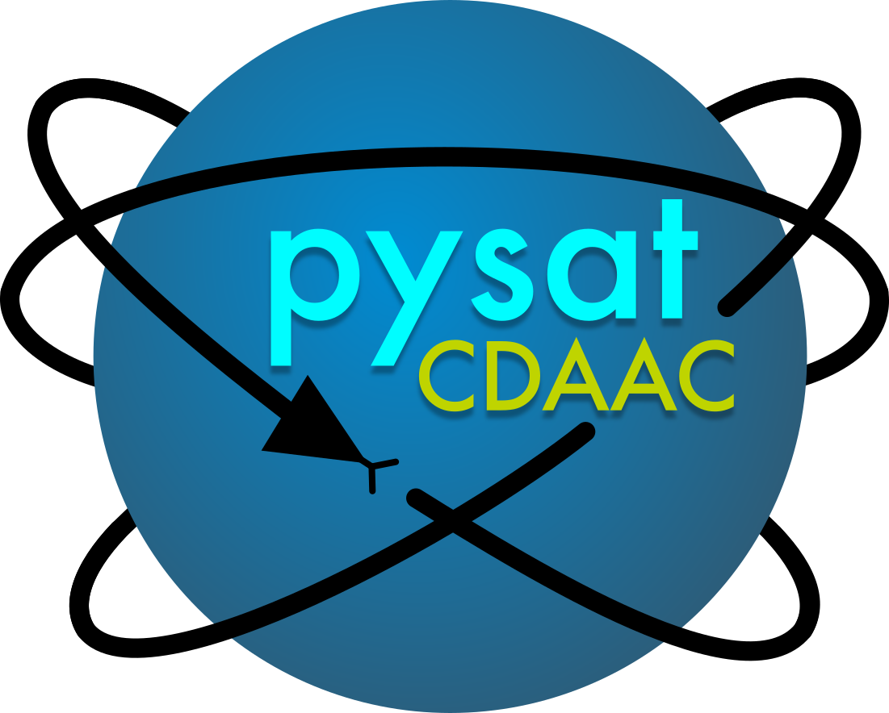

Overview
========

This documentation describes the pysatCDAAC module, which contains routines to
interface with space science data hosted at the COSMIC Data Analysis and Archive
Center (CDAAC) as pysat.Instrument objects.

